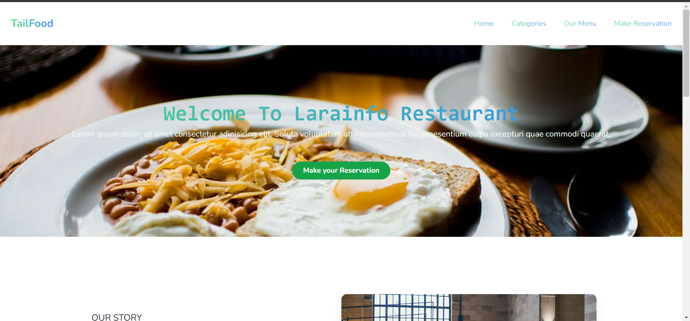
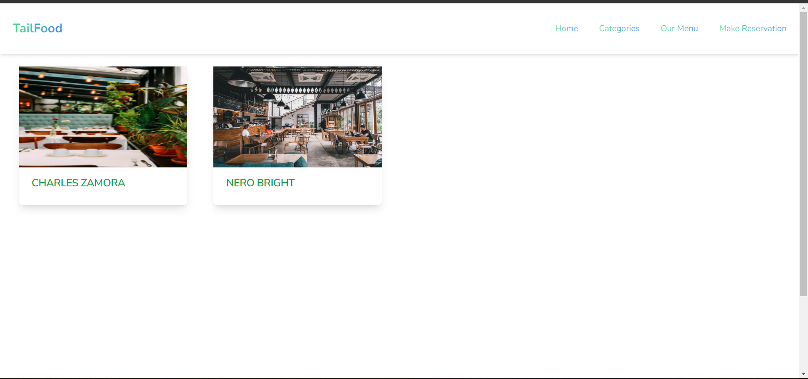
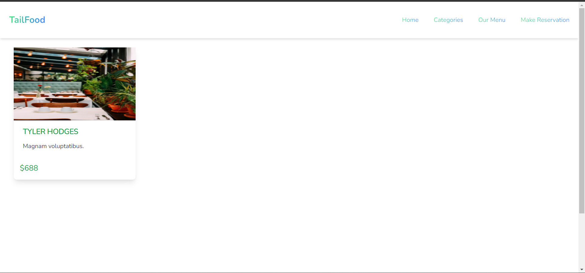
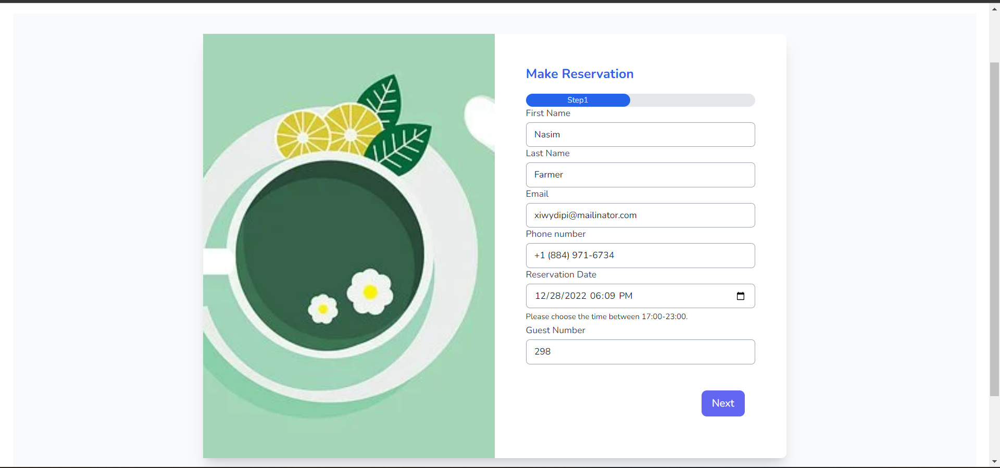
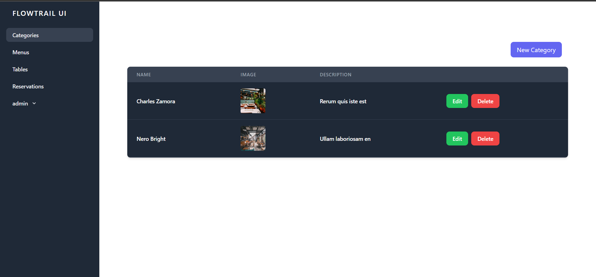
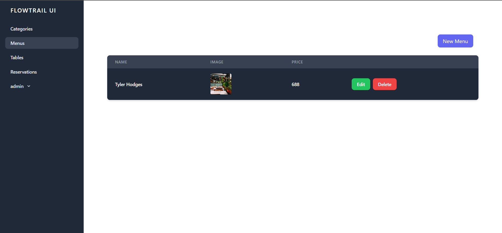
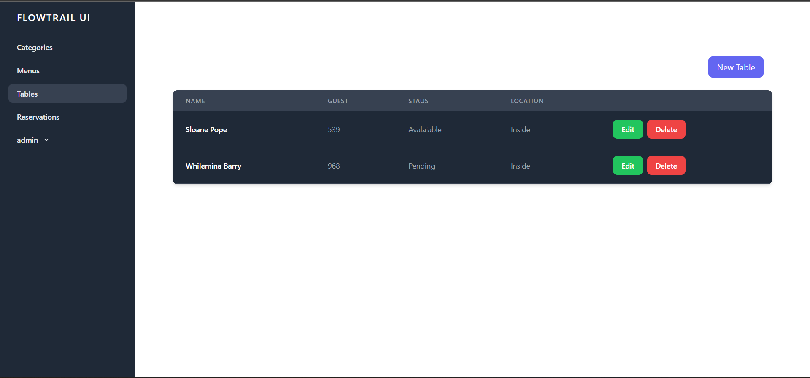

### Installation

```
composer install
```
```
npm install
```
```
npm run build
```
```
php artisan storage:link
```
```
php artisan migrate
```
```
php artisan serve
```

### Welcome
<br />


### Categories
<br />


### Menu
<br />


### Order
<br />


### Admin Category
<br />


### Admin Menu
<br />


### Admin show table
<br />

